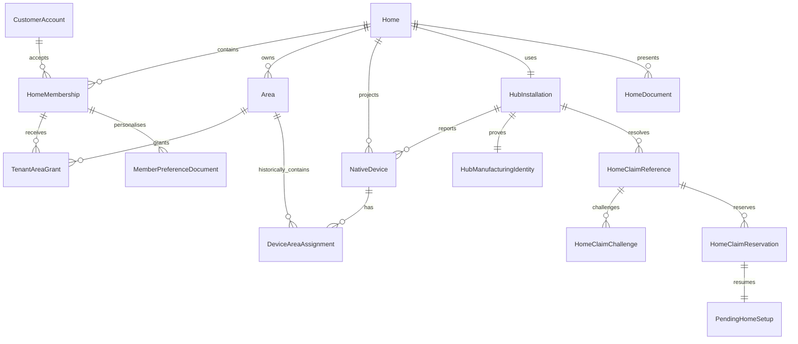

# Native Dinodia V2 foundation schema ownership

Status: implemented foundation baseline. This document is the reviewable contract for the
32-table Prisma migration in `prisma/migrations/00000000000000_native_v2_lean_foundation`.
It is intentionally free of customer data and secrets.

## Authority rules

- `CustomerAccount` identifies a customer, but never grants property authority by itself.
- `CompanyEmployeeAccount` is a separate security principal. An employee role cannot become a customer membership.
- `HomeMembership` is the only accepted customer role source. `TenantAreaGrant` is the only tenant-area grant source.
- `Area` is the original Dinodia OS area identity. `overrideName` is presentation only.
- `NativeDevice` is a bounded cloud inventory projection. Dinodia OS remains authoritative for live state and dynamic controls.
- `HomeClaimReference`, `HomeClaimChallenge`, `HomeClaimReservation` and `PendingHomeSetup` are the foundation claim boundary; the final public claim UI belongs to its numbered stage.
- `AuditEvent` is append-only and metadata must be redacted. `IdempotencyRecord` and `ReplayNonce` are generic security primitives.

## Approved model inventory

| Model | Owner/source of truth | Allowed writers | Main readers | Retention/deletion |
|---|---|---|---|---|
| CustomerAccount | Dinodia customer identity | Auth/account service | Customer auth, membership selector | Cascade with final account deletion |
| CompanyEmployeeAccount | Company Portal employee identity | Company Portal employee administration | Staff auth/work assignment | Separate from customer deletion |
| TrustedDevice | Customer account security | Customer security service | Session/revocation service | Account cascade; removal is account-wide |
| CustomerSession | Customer auth session | Auth/session service | Request auth | Revoked/expired cleanup |
| PolicyAcceptance | Account policy state | Policy service | Auth gates | Account cascade; policy retention policy |
| AuthChallenge | Email/security challenge | Auth service | Verification/reset flows | Expiry cleanup |
| StepUpAuthorization | One-use sensitive-operation proof | Security service | Sensitive operation dispatcher | Consume/expire cleanup |
| Home | Property lifecycle identity | Provisioning/lifecycle service | All home-scoped services | Preserved physical identity through ownership reset |
| HomeMembership | Accepted customer-to-home relationship | Membership service | Every customer authorization decision | Removed on access removal; cascades home cleanup |
| Area | Original OS area projection | Installer/OS sync service | Grants, inventory, floorplan | Retired, not physically deleted while history exists |
| TenantAreaGrant | Tenant access to original area | Owner/manager membership service | Tenant authorization | Deleted immediately on access removal |
| NativeDevice | Bounded OS inventory projection | OS ingestion/commissioning service | Management views, later analytics/Alexa | Private tenant rows deleted with owner device lifecycle |
| DeviceAreaAssignment | Historical device-area relation | OS sync/staff commissioning | Historical analytics and current area | Historical rows retained per analytics policy |
| HubManufacturingIdentity | Registered genuine hub identity | Trusted manufacturing/provisioning flow | Hub pairing verifier | Previous generation revoked, not reused |
| CompanyOperationalWorkItem | Assigned staff authority | Company Portal | Provisioning/configuration gates | Activity retention; stateful work lifecycle |
| HubInstallation | Home-to-hub lifecycle | Provisioning/OS sync | Hub status and lifecycle gates | Preserved through ownership reset |
| HubCredentialVersion | Hub credential lifecycle | Credential dispatcher | Hub/session verification | Revoked versions retained for audit/anti-replay |
| HubProvisioningAttempt | One pairing attempt | Provisioning protocol | Portal/hub handshake | Expiry cleanup; no plaintext credential |
| MembershipInvitation | Pending membership relationship | Owner/manager invitation flow | Inviter/recipient pending page | Expires/replaced rows removed from active view |
| MembershipInvitationArea | Invitation area selection | Invitation transaction | Invitation preview/acceptance | Cascades with invitation |
| AreaQrCredential | Original-area QR generation | Authorised staff | Room request flow | Replaced/disabled generation retained for denial |
| AreaAccessRequest | Pending tenant area request | QR request/owner decision | Owner/manager pending page | Seven-day expiry and decision audit |
| HomeClaimReference | One logical initial/transfer claim | Provisioning/transfer service | Claim resolver | Consumed/replaced/revoked, no reusable secret |
| HomeClaimChallenge | One LAN hub-label challenge | Hub challenge service | Claim verifier | Short-lived and one-use |
| HomeClaimReservation | First verified claimant lock | Claim transaction | Claim setup resume | 30-minute unfinished reservation cleanup |
| PendingHomeSetup | Pre-membership setup checkpoint | Claim setup transaction | Claimant resume state | Deleted at expiry; activated at completion |
| HomeDocument | Shared floorplan/presentation document | Owner/manager floorplan service | Home view | Replaced by revision; reset generates clean default |
| MemberPreferenceDocument | Per-membership layout/filter/quiet-hour document | That member | Member UI/preferences | Membership cascade; cross-phone within membership |
| AuditEvent | Redacted append-only audit | All authorised services | Activity/security review | Explicit purgeAt; management 12 months |
| DeletionSecurityReceipt | Anonymous deletion receipt | Lifecycle deletion service | Security review | 12 months, no PII |
| IdempotencyRecord | State-change replay boundary | State-change services | Transaction boundary | Expiry cleanup |
| ReplayNonce | Signed request replay boundary | Hub/security services | Request verifier | Expiry cleanup |

## Old transitional model disposition

The previous 66-model schema was a transitional Home Assistant/product schema. It is not copied
into the native baseline. Git history and frozen backups remain the recovery source.

| Previous model | Disposition | Replacement/owner |
|---|---|---|
| Home | REPLACE | Home |
| AuditEvent | REPLACE | AuditEvent |
| AuditEventArchive | DELETE | AuditEvent retention/purge |
| User | REPLACE | CustomerAccount |
| CompanyEmployeePrincipal | REPLACE | CompanyEmployeeAccount |
| HomeMembership | REPLACE | HomeMembership |
| HomeMembershipAreaGrant | REPLACE | TenantAreaGrant |
| PolicyAcceptance | REPLACE | PolicyAcceptance |
| LoginIntent | DELETE | AuthChallenge in foundation; later auth stage |
| TrustedDevice | REPLACE | TrustedDevice |
| DeviceRegistry | DELETE | NativeDevice |
| AuthChallenge | REPLACE | AuthChallenge |
| StepUpApproval | REPLACE | StepUpAuthorization |
| RemoteAccessLease | DEFER | Support stage |
| HaConnection | DELETE | HubInstallation |
| HubInstall | REPLACE | HubInstallation |
| HubManufacturingIdentity | REPLACE | HubManufacturingIdentity |
| HubProvisioningAttempt | REPLACE | HubProvisioningAttempt |
| OsOperatorWorkflow | REPLACE | CompanyOperationalWorkItem |
| HubIncident | DEFER | Notifications/operations stage |
| HomeownerPolicyAcceptance | DELETE | PolicyAcceptance |
| HomeownerPolicyNotificationDelivery | DEFER | Notifications stage |
| PendingHomeownerOnboarding | REPLACE | PendingHomeSetup |
| HubOperatorCredential | REPLACE | HubCredentialVersion |
| OperatorSessionHandoff | DEFER | Security stage using foundation work item |
| HubToken | DELETE | HubCredentialVersion |
| HubAgentNonce | REPLACE | ReplayNonce |
| AccessRule | DELETE | HomeMembership + TenantAreaGrant |
| HomeContact | DELETE | HomeMembership |
| Room | DELETE | Area + AreaQrCredential |
| RoomAccessRequest | REPLACE | AreaAccessRequest |
| RoomAccessApprovalToken | DELETE | AuthChallenge/AreaAccessRequest transaction |
| Device | REPLACE | NativeDevice |
| MonitoringReading | DEFER | Analytics stage |
| BoilerTemperatureReading | DEFER | Analytics stage |
| BoilerUsageAccumulator | DEFER | Analytics stage |
| RadiatorUsageAccumulator | DEFER | Analytics stage |
| ElectricUsageAccumulator | DEFER | Analytics stage |
| ElectricUsageReading | DEFER | Analytics stage |
| ElectricUsageDailyRollup | DEFER | Analytics stage |
| AlexaAuthCode | DEFER | Alexa stage |
| NativeAutomation | DEFER | Automation stage |
| NativeAutomationAction | DEFER | Automation stage |
| NativeAutomationDelivery | DEFER | Automation stage |
| NativeAutomationExecution | DEFER | Automation stage |
| NativeAutomationRequest | DEFER | Automation stage |
| NativeAutomationTrigger | DEFER | Automation stage |
| AlexaRefreshToken | DEFER | Alexa stage |
| AlexaSkillUserLink | DEFER | Alexa stage |
| AlexaHomeConnection | DEFER | Alexa stage |
| AlexaNativeEndpointProjection | DEFER | Alexa stage |
| AlexaConnectIntent | DEFER | Alexa stage |
| AlexaDirectiveReceipt | DEFER | Alexa stage |
| AlexaEventToken | DEFER | Alexa stage |
| NewDeviceCommissioningSession | DEFER | Commissioning stage |
| AreaDisplayOverride | REPLACE | Area.overrideName |
| LabelDisplayOverride | DELETE | NativeDevice.customerLabel |
| TenantVirtualArea | DELETE | Derived equal-name presentation; original Area IDs remain |
| TenantDeviceDisplayOverride | REPLACE | NativeDevice.overrideName/customerLabel |
| AutomationOwnership | DEFER | Automation stage |
| HomeAutomation | DEFER | Automation stage |
| SupportRequest | DEFER | Support stage |
| SupportAccessSession | DEFER | Support stage |
| Stage1ClaimReservation | REPLACE | HomeClaimReservation |
| Stage1ClaimAudit | REPLACE | AuditEvent |
| SupportRequestApprovalToken | DEFER | Support stage |

## Relationship diagram

## Lifecycle and privacy decisions

| Lifecycle | Preserved | Removed/invalidated | Authority |
|---|---|---|---|
| Initial hub registration | Home, hub identity/install, original areas | No membership yet | Assigned employee work |
| Initial homeowner claim | Physical hub/areas/devices | Claim consumed, pending setup activated | First verified claimant + installation completion |
| Ownership transfer | Active tenants, physical infrastructure, in-progress installation | Outgoing owner and property managers after completion | Outgoing owner / authorised staff |
| Deregister Full Home | Hub, tunnel, address/postcode/timezone, areas, permanent devices, Room QR identities | Customer memberships, layouts, overrides, automation/Alexa/history projections | Original owner |
| Area retirement | Original area identity and historical assignments | Current grants, QR and current presentation | Authorised Dinodia staff |
| Permanent device replacement | Historical predecessor | Current inventory row for old device | Authorised staff/OS sync |
| Tenant membership removal | Property infrastructure | Tenant grants, private devices and affected private automations | Owner/manager or lifecycle service |
| Final account deletion | Anonymous security receipt | Account, sessions, memberships and account-owned data | Account/lifecycle service |

| Reader | Customer account | Home membership | Property device | Tenant device | Employee-only work |
|---|---|---|---|---|---|
| Owner | Own | Own home | Read/manage metadata, no command | Never visible | Not employee authority |
| Property manager | Own | Assigned home | Read/manage metadata, no owner-only actions | Never visible | Not employee authority |
| Owning tenant | Own | Own tenant membership | Control only granted underlying areas | Own only | Never employee authority |
| Other tenant | Own | Own membership | Control only own grants | Never visible | Never employee authority |
| Company employee | Separate principal | Work assignment only | Staff workflow permissions | Only if workflow explicitly allows, no accidental disclosure | Assigned operational authority |
| Hub/system | No customer identity | Reports identity | Writes bounded projection | Writes owner-scoped row | System-only lifecycle work |

## Later-stage extension map

Later stages may add feature tables referencing these stable IDs, but may not create a second
membership, area, device ownership, claim, employee identity or hub identity authority.

| Later capability | Foundation references | Must not duplicate |
|---|---|---|
| Secure OS access/provisioning | CompanyEmployeeAccount, CompanyOperationalWorkItem, HubManufacturingIdentity, HubInstallation, HubCredentialVersion, ReplayNonce | Employee roles, hub identity, credential authority |
| Home/Room QR and claim | HomeClaimReference, HomeClaimChallenge, HomeClaimReservation, PendingHomeSetup, AreaQrCredential, AreaAccessRequest | Home/Room claim authority |
| Native inventory and controls | NativeDevice, DeviceAreaAssignment, Area, HomeMembership, TenantAreaGrant | Live control catalogue or tenant access system |
| Homeowner/property-manager shell | HomeMembership, Area, NativeDevice, HomeDocument, AuditEvent | Global role or ownerId shortcut |
| Tenant devices/commissioning | NativeDevice ownerMembershipId, technicalLabel, currentAreaId | Separate tenant-device table |
| Analytics | NativeDevice analyticsCategory, DeviceAreaAssignment, Home | HA/device duplicate inventory |
| Automations | HomeMembership, NativeDevice, dynamic descriptor revision | Device automation-ID column or global automation owner |
| Alexa | HomeMembership, TenantAreaGrant, NativeDevice | Homeowner Alexa authority or static capabilities |
| Support | CustomerAccount, HomeMembership, CompanyEmployeeAccount, AuditEvent | Customer/employee identity merge |

## Review checks

- `prisma/schema.prisma` contains exactly the 32 approved models above.
- The baseline migration creates those tables and owns all partial indexes/check constraints.
- No old transitional model is imported by the active `src` tree.
- No direct `anon`/`authenticated` grants are present after migration.
- Any later model must be justified in its numbered plan and must reference this authority map.
# Native V2 schema ownership and integrity boundary

The schema is a lean Native Dinodia V2 foundation. It is not a copy of the old Home Assistant database. Vercel is the only active backend and Supabase is accessed by the server-side platform only.

## Integrity rules

- `HomeMembership` is the only household role authority.
- Composite same-home keys and migration-level constraints prevent a record from Home A referring to authority or infrastructure in Home B.
- `DeviceAreaAssignment` is the only current-area authority. The open row (`validUntil IS NULL`) is current; closed rows are historical.
- Tenant-device access requires the owning tenant membership plus a current grant to the current underlying area.
- Tenant devices retain `technicalLabel=tenant_device`; `customerLabel` is presentation only.
- Manufacturing identity generations are retained and revoked; only one generation for a serial may be active.
- Invitations and access requests are pending relationships and are not memberships or grants.
- Security authority IDs have foreign keys or are explicitly marked non-authoritative snapshots.

## Intentionally deferred feature tables

Support, notifications, installation requests, analytics accumulators, automations, Alexa links and device-control history are added only by their later Native V2 plans. They must reference these foundation IDs and must not introduce duplicate home, membership, area or device authority.
